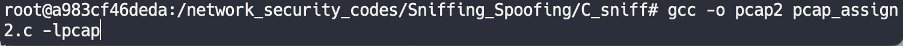
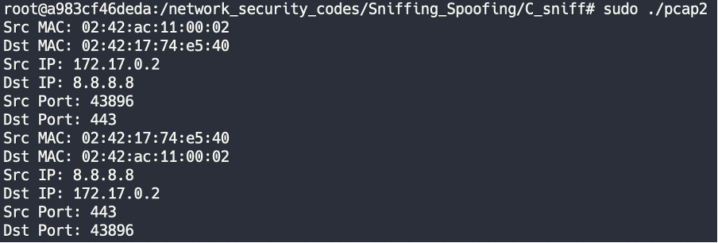

# PCAP-Programming

## 프로젝트 소개
- 리눅스 패킷 캡쳐 라이브러리 libpcap을 활용해 구현.
- eth0 이더넷 환경에서의 TCP 패킷에 대한 정보를 출력함.
- TCP 패킷의 정보로는 MAC 주소, IP 주소, 포트 번호, 메시지 등을 출력함.


<br><br>
## 실행 방법
```
sudo apt-get install libpcap-dev
gcc -o pcap2 pcap_assign2.c -lpcap
sudo ./pcap2
```


<br><br>
## 실행 결과물



<br><br>
## 상세 설명
- myheader.h에 미리 정의되어 있는 ethheader, ipheader, tcpheader를 통해 실제 패킷의 각 프토토콜 헤더가 시작하는 지점의 포인터를 지정.
- 표기법에 맞추어 출력하기 위해 IP 주소는 inet_ntoa 함수를, MAC 주소는 직접 작성한 print_mac 함수를 사용해 출력.
- 현재 코드는 eth0 이더넷 환경에서의 패킷을 캡쳐하므로 다른 이더넷 환경에서의 패킷 정보를 출력하고자 한다면 "eth0" 을 수정하여 사용하면 됨.
